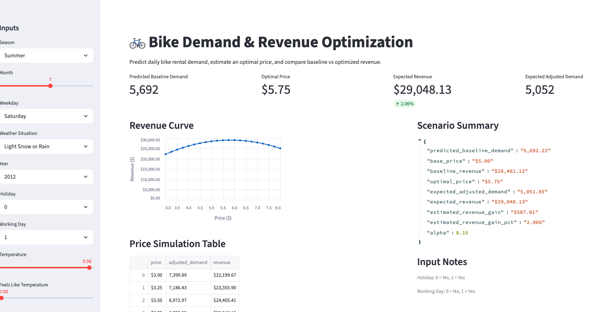

# Bike-Rental-Revenue-Optimization
This project builds an end-to-end machine learning pipeline for predicting bike demand and subsequent adjusted demand, and then optimizes revenue by finding a best price at which to rent out bikes.


## Live Demo


Try the app here: https://bike-rental-revenue-optimization-3ezz8dswejjajsle7fabh2.streamlit.app/


The project predicts bike rental demand based on temporal and weather features, and then applies a pricing model estimate revenue and identify an optimal price in relation to a set base price. The Streamlit app provides an interactive dashboard allows users to simulate demand and explore optimal pricing strategies and decision making in real time. 


## App Preview




## Project Overview


As stated above this project builds an end-to-end machine learning pipeline to predict daily bike rental demand and then extends the model to include a pricing simulation layer to optimize revenue. The model combines predictive modeling with assumptions based on customer sensitivity to price (elasticity).


## Business Problem


Companies often need to forecast demand to make operational decisions, one of which is pricing with the objective of maximizing revenue. Real-world datasets are useful for predicting baseline demand, but also often lack pricing data, which leads to the need for customer behavior simulation, as demonstrated in this project. The goal was to not only accurately predict demand, but then adjust demand based on price shift from a set base price, and evaluate the impact of this price shift on revenue. 


## Dataset


The dataset used in this project was provided by UC Irvine, and is linked here: https://archive.ics.uci.edu/dataset/275/bike+sharing+dataset


It includes a variety of input features, including temporal (year, month, weekday), categorical (season, weather conditions), and environmental (temperature, humidity, windspeed) data. The size of the dataset is about 731 observations. The target variable was total rent count on a given day (cnt).


## Data Preprocessing & Feature Engineering

Elements included in data preprocessing and feature engineering are as follows:


- Dropping of redundant columns (e.g. date, since year, month, and day are already features)
- Converting categorical variables using one-hot encoding (season, weekday, weather, etc.)
- Created cyclical features for month (sine and cosine transformations to better capture seasonality since, for example, December and January are numerically far apart but seasonally very close)
- Ensured no data leakage between train and test sets
- Split data into train and test sets


## Model Development


The model used Random Forest Regressor as it handles nonlinear relationships well, is robust to feature scaling, and is easily interpretable. Parameters such as maximum depth and minimum samples per leaf were tuned to reduce overfitting, and the model was evaluated using RSME score. 


## Model Performance


Train RSME was ~512 while test RSME was ~739, with a target mean of ~4500. This means the model generalizes well (demonstrated by the small gap between train and test RSME), and that prediction error is ~16-17% of mean demand. Performance was strong for this dataset.


## Pricing Simulation

The bike dataset, while robust, did not include any information pertaining to bike rental pricing. The project therefore introduced a simulated pricing model that assumed linear demand elasticity, implying that demand decreases as price rises. After a baseline demand was determined from the machine learning model, an adjusted demand was calculated as a function of price, relying on a set base price and a price sensitivity coefficient simulating how strongly customers would respond to price change. Revenue was then calculated as (price)x(adjusted demand). 


## Pricing Optimization


For each predicted demand value:

- A range of candidate prices were evaluated
- Adjusted/expected demand was computed for each candidate price
- Revenue was calculated for each candidate price

The price that maximized revenue was then selected. 


## Key Results


With a realistic elasticity assumption (alpha = 0.15), the average revenue increase was ~2.06%. Lower elasticity coefficients, such as alpha = .08, produced unrealistic behavior, always maximizing price but at the cost of dismissing the reality of customer reaction to high prices. These results demonstrate the importance of modeling assumptions when it comes to pricing decisions and, even more importantly, balancing realism with optimization. A revenue increase of 2.06% might sound underwhelming, but in a real-world scenario can actually produce meaningful increases in revenue. 


It was also found that optimal price remains highly stable across a wide variety of scenarios, while revenue and predicted baseline and adjusted demand fluctuate. This result is expected due to the state of the elasticity parameter in the pricing model--alpha--being fixed. As demand is modeled as a function of price with constant elasticity, changes in baseline demand primarily scale revenue rather than shifting optimal price. Thus, predicted and adjusted demand vary meaningfully across scenarios while the optimal price remains withing a narrow range. 


## Key Insights


- Feature engineering significantly impacts model performance
- Improper encoding can lead to unstable, misleading predictions
- Small modeling assumptions (such as elasticity) dramatically affect outcome
- Realistic models often produce modest but meaningful improvements

## Limitations

Limitations of the project included:


  - Elasticity assumption rather than learned from historical transaction data
  - Pricing was simulated rather than provided in the dataset, limiting the real-world applicability
  - The dataset was daily aggregated, so intra-day pricing behavior was not captured


## Future Improvements


Potential future improvements for this project could include:


- Learning elasticity from data instead of assigning a fixed value so that optimal price is able to make meaningful shifts based on weather and temporal conditions
- Incorporating time-series models
- Adding uncertainty estimates


## Folder Structure:
```

├── data/            # dataset used for the project
├── notebooks/       # Jupyter notebook for exploration and development
├── src/             # core Python scripts
│   ├── preprocessing.py
│   ├── pricing.py
│   ├── train_bike_demand.py
│   └── predict_demand.py
├── models/          # saved trained model artifacts
├── requirements.txt
└── README.md
```
 

## Installation:


- pip install -r requirements.txt
- python src/train_bike_demand.py
- python src/predict_demand.py

## How to Run Locally


- Clone the repository
- Install dependencies using requirements.txt
- Run the app with:
  - streamlit run bike_app.py

